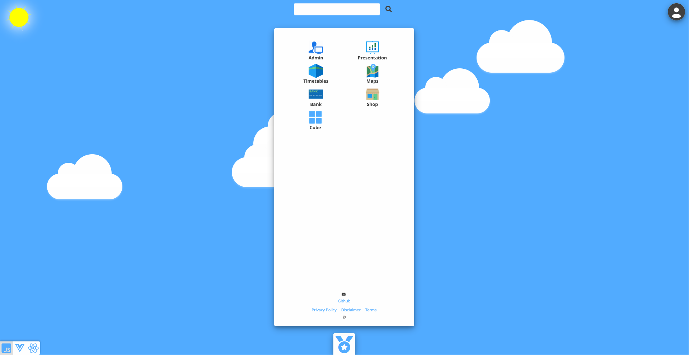

# App portfolio



An app portfolio created as a reference platform with refactored and simplified solutions of common used third party solutions and support for any language and regional settings.

Comparison tables with solutions are presented in the Presentation app and Apps and Server menus that includes:
- OWASP
- Vue/React
- Transpiler/build step
- Polyfill
- Jasmine/Jest
- JSON Web token
- Web Crypto API
- HTTPS
- SSL
- SQL databases
- MongoDB
- Redis
- Microsoft Azure Cosmos DB
- GraphQL
- Express
- Swish payment UI
- Stripe payment process
- Pix Brazil
- Leaflet
- JSDoc
- ReadtheDocs
- Markdown

All apps use pure Javascript (ES6+), Typescript, Vue, React, HTML and CSS without any build steps
All apps use Vue SFC pattern and realtime switchable framework between Vue, React and Javascipt.
All apps use pure div elements in HTML without any semantic HTML and without any specific user agent CSS.
All apps use mostly logographic UI compared to traditional phonemic UI

Apps and server use encrypted REST API and app resource transport including fonts without the need of HTTPS.
Server uses Node.js and does not use any third party modules in production.
Server renders apps using Vue SFC pattern.
Server uses secure REST API with openAPI documentation used as documentation and business logic.
Server uses ORM Database and noSQL pattern.

Implemented with many examples of patterns
- Web crypto API without browser or protocol restrictions
- Software as a Service (SaaS)
- Infrastructure As Code (IaC)
- Frontend For Backend (FFB)
- Backend For Frontend (BFF)
- Backend For External (BFE)
- ISO20022
- openAPI
- Continuos Integration and Continous Delivery/Deployment (CI/CD)
- Identity and Access Management (IAM)
- microservice architecture using service registry, message queue and IAM pattern
- object relational mapping (ORM) database with PK, UK and FK table constraints including cascade delete for tables and support for non tables like key value and documents
- circuitbreaker
- message queue
- email message pattern using message queue pattern
- factory
- race condition
- file transaction management
- entity/resource data model using hybrid JSON storage concept with flexible and minimal data model design
- role based and secure app server functions (simplified version of Function as a Service and serverless functions model)
- batch cron pattern

CI/CD implemented using batch server with scheduled git commands using Linux systemctl managed services on server
Runs in Node.js.
	
pgModeler designed ORM data model.
Databases used as reference to implement database patterns are MongoDB, MariaDB, MySQL, Oracle, PostgreSQL and SQLite.

Any regional setting supported including direction right to left. More than 500 locales with language and
country translations. Support for different Arabic scripts and different font heights (Nastaliq). Logographic UI chosen is implemented to minimize text usage and to provide simpler and better explanation to a global audience.

Developed in VSCodium with integration with Github following 
Scrum agile project management framework and deployed on Oracle Cloud and Linux server.

# Installation

Full documentation in /apps/common/src/functions/documentation or in presentation app when installed

## DEVELOPMENT

Project focuses on open source directive and supports Linux development only

```
sudo apt install git
sudo apt install curl
sudo apt install codium

git clone [repository .git url] app_portfolio
sudo curl -sL https://deb.nodesource.com/setup_20.x | sudo -E bash -
sudo apt install nodejs
npm install
``` 
open repository folder in VSCodium
launch configured (launch.json) from VSCodium

App Portfolio

optional:
Microservice Batch

enter http://localhost:3333 
set admin name and password first time in admin app
install optional demo users
		
enter main server        
http://localhost:3000
	
## LINUX SERVER

Use Linux server that supports apt

see full documentation how to install on a cloud service using Terraform

```
cd $HOME
git clone [repository .git url] app_portfolio
sudo curl -sL https://deb.nodesource.com/setup_20.x | sudo -E bash -
sudo apt install nodejs

node server/init.js

#or run as service:
sudo systemctl enable $HOME/app_portfolio/server/scripts/app_portfolio.service
sudo systemctl daemon-reload
sudo systemctl start app_portfolio.service
```
	optional (batch and git are used for CI/CD solution):
```	
node /serviceregistry/microservice/batch/server.js 

#or run as service:

sudo systemctl enable $HOME/app_portfolio/server/scripts/app_portfolio_microservice_batch.service
sudo systemctl daemon-reload
sudo systemctl start app_portfolio_microservice_batch.service

```

enter http://[domain]:3333
set admin name and password first time in admin app
install optional demo users

all data and configuration files are in /data directory that is created when starting the first time

enter main server        
http://localhost:3000