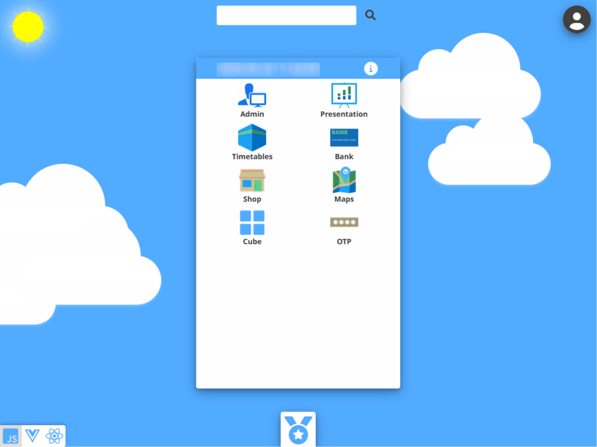

# App portfolio



An app portfolio created as a reference platform and implemented with support for any language and regional settings.
	
All apps use pure Javascript (ES6+), Typescript, Vue, React, HTML and CSS without any build steps
All apps use Vue SFC pattern and realtime switchable framework between Vue, React and Javascipt.
All apps use pure div elements in HTML without any semantic HTML and without any specific user agent CSS.
All apps use mostly logographic UI compared to traditional phonemic UI
All apps use common user access and any user data is saved in each app for the user.

Implemented with less third party libraries and module dependencies for performance and better maintainability.
Server renders basic app HTML using parameters.
Server uses secure REST API with authentication middleware that authenticates claims in access or id tokens and 
also authenticates request access to resources at user, app and domain level.
Databases use common ANSI SQL with minium differences for all databases, 
Databases use centralized and conslidated common SQL parameter syntax and consolidated data validation in Javascript 
for all databases.

Implemented with many examples of implementation patterns 
- microservice architecture
- circuitbreaker
- message queue
- factory
- race condition
- file transaction management
- object relational mapping (ORM)
- frontend for backend (FFB)
- backend for frontend (BFF)
- entity/resource datamodel using hybrid JSON storage concept with flexible and minimal data model design
- role based and secure app server functions (simplified version of Function as a Service and serverless functions model)
- ISO20022
- openAPI
- CD/CI
- batch cron pattern
- infrastructure as code (IaC)

Continuous deployment implemented using batch server with scheduled git pull requests and automatic restart 
of Node.js using pm2 managed processes.
Runs in Node.js using Express framework.
	
Oracle SQL Developer Data model designed data model.
Databases supported are MariaDB, MySQL, Oracle, PostgreSQL and SQLite. Uses SQLite as default with no extra configuration needed.
Centralized data model error handling of database errors, constraints errors and application errors showed in users language.

A global support implemented in client with ALL Unicode characters supported by Noto Sans font
included different arabic scripts and different font heights (Nastaliq).
Any regional setting supported including direction right to left. More than 500 locales with language and
country translations. The mayor 30 languages are translated in the apps. Icons are frequently used 
to minmize text usage and to provide simplier and better explanation to a global audience.

Developed in Visual Studio Code in Windows with integration with Github and Jira following 
Scrum agile project management framework and deployed on Oracle Cloud and Ubuntu server.

# Installation

Full documentation in /apps/common/src/functions/documentation or in presentation app when installed

## WINDOWS DEVELOPMENT

install NodeJs from https://nodejs.org/
install VS Studio Code from https://code.visualstudio.com/download
```
git clone https://github.com/forsbergapp/app_portfolio.git
npm install
``` 
launch configured (launch.json) from Visual Studio Code
App Portfolio

optional:
Microservice Geolocation
Microservice Batch
Microservice Mail

enter http://localhost 
set admin name and password first time in admin app
install db and optional demo users so apps will start
		
	
## UBUNTU SERVER

see full documentation how to install on a cloud service using Terraform

```
git clone https://github.com/forsbergapp/app_portfolio.git app_portfolio
sudo curl -sL https://deb.nodesource.com/setup_20.x | sudo -E bash -
	    sudo apt install nodejs
        sudo setcap CAP_NET_BIND_SERVICE=+eip /usr/bin/node
        npm install --omit=dev
sudo npm install -g pm2

pm2 start $HOME/app_portfolio/server/init.js --cwd $HOME/app_portfolio --name app_portfolio -o "/dev/null" -e "/dev/null" --watch --ignore-watch=".git .vscode .well-known data docs node_modules microservice .gitignore .eslintignore .eslintrc.js jsdoc.json README.md tsconfig.json"

```
	optional (batch and git are used for CD/CI solution):
```	
pm2 start $HOME/app_portfolio/microservice/batch/server.js --cwd $HOME/app_portfolio --name batch --watch="microservice" --ignore-watch="microservice/geolocation microservice/mail" --watch-delay 10

pm2 start $HOME/app_portfolio/microservice/geolocation/server.js --cwd $HOME/app_portfolio --name geolocation --watch="microservice" --ignore-watch="microservice/batch microservice/mail"

pm2 start $HOME/app_portfolio/microservice/mail/server.js --cwd $HOME/app_portfolio --name mail --watch="microservice" --ignore-watch="microservice/batch microservice/geolocation"
```

enter http://[domain]
set admin name and password first time in admin app
install db and optional demo users so apps will start
set SSL, DNS settings etc if necessary

all data and configuration files are in /data directory that is created when starting the first time